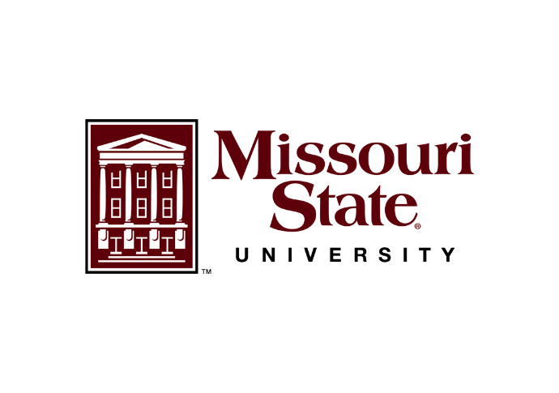
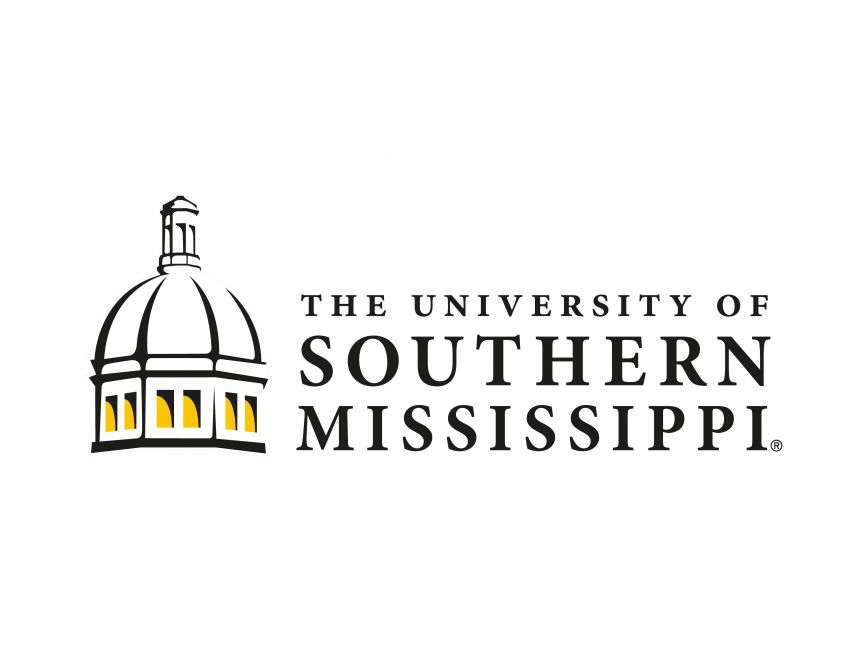
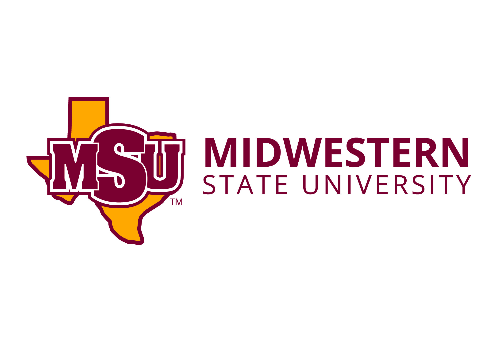

# Welcome!

Hello! I’m Nicholas Maxwell. I’m currently an Assistant Professor of Psychology at [Midwestern State University](https://www.msutexas.edu) in Wichita Falls, TX where I lead the Memory, Metamemory, and Learning lab. Prior to joining the faculty at MSU Texas, I received my MS in Experimental Psychology from [Missouri State University](https://www.missouristate.edu/) and completed my doctoral training in Cognitive Psychology at the University of [Southern Mississippi](https://www.usm.edu/) in 2022. I also have a BA in psychology from [Mississippi State University](https://www.msstate.edu). Too many MSU's, I know!

My research primarily focuses on human memory and metamemory. Specifically, I’m interested in the degree to which individuals can accurately predict later test performance, what factors influence the accuracy of their predictions, and whether or not making memory predictions in general can benefit memory (vs. not making predictions). For more information about my research, please take a look at the Research page. I also have links to various teaching materials, my CV (see the .pdf icon at the top right to download!), and direct links to some R shiny applications that I have developed to facilitate research in cognitive psychology.
 
Finally, in addition to researching questions surrounding memory and metamemory, I’m also interested in big data, predictive modeling, and how these approaches can be leveraged to solve theoretical and practical problems. I’m also an advocate for open science practices and research transparency.

I’m always happy to chat science! Please feel free to reach out to me at nicholas.maxwell@msutexas.edu. Thanks for stopping by!

   